Robotics Engineer with 7+ years of professional experience spanning industrial robotics operations, safetycritical embedded firmware, and real-time systems on RISC-V / Zephyr RTOS. Currently leading firmware
development for AMD (GPU cores, BIOS / UEFI) as Lead Firmware Engineer at Qubika for a Tier-1 GPU/accelerator vendor. Mechatronics engineer with an MSc in Statistics & Data Science (MIT–UTEC), bringing combined hardware, software and ML foundations to robotics. Hands-on with ROS / ROS 2, Nav2, MoveIt, Gazebo, URDF, RViz, Visual SLAM, and motor control. Native Spanish, fluent English (CAE C1). Available US business hours; authorized to work remotely as an international contractor.

---

  
  

<!---->
<!---->
<!---->